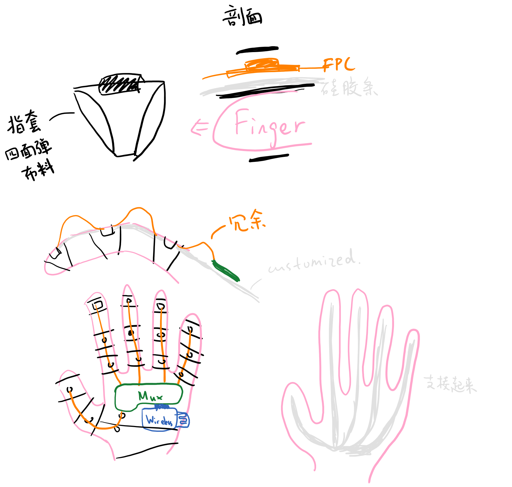
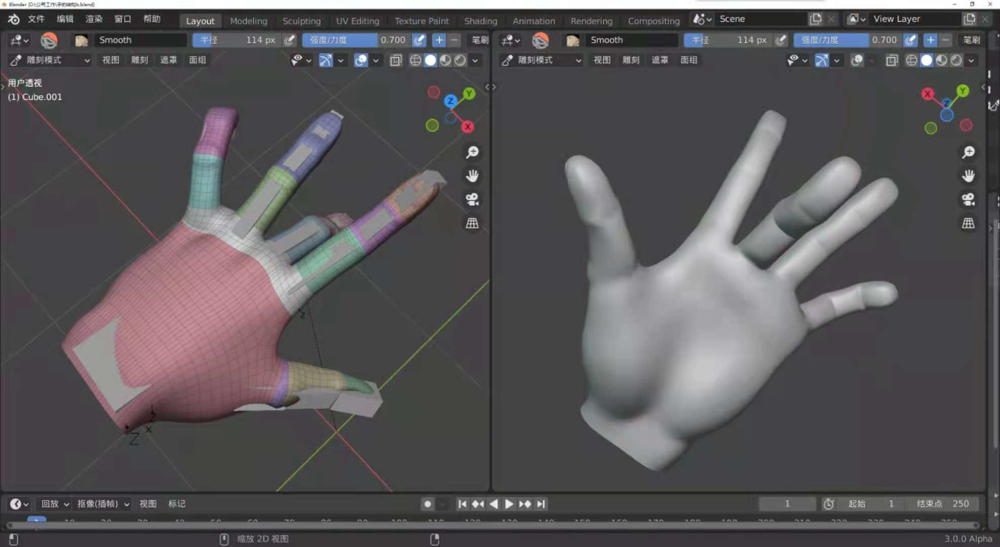

# Data Glove

> Author: [Jiangfan Li](mailto: rdemezerl@gmail.com)

## 设计架构

### 硬件设计

按照功能分成了3块独立的板：

* 传感器
* 传感器读取
* 无线通信及主控

传感器板的设计会比较固定，与手套外形的设计比较相关，单独摘出来一块。

传感器读取板读取传感器数据并转给主控。根据后面的需要修改，比如加上压力传感器板，就需要新的读取器。将读取与主控分离的目的是为了加速并行读取的能力；传感器的传输速度可能不高，多个传感器串行读取会很耗时（如BNO 2ms*16~=30fps），加读取板并行读取以加速。

主控目前使用ESP32开发板。

### 手套与元件安装

大致构想

### 上位机

通过WiFi在局域网内与硬件连接（当然也可以做一个蓝牙的版本），读取的数据存储And/Or实时显示（by MANO）。

## 硬件各模块说明

TODO [设计参考datasheet和library等资料]()

外协制作了5片`Glove_FPC_I2C`，2*2片`SensorMux`；

`SensorMux_Adapter_Conn`, `SensorMux_Adapter_Load`和`SensorMuxTca`需要手焊。

### 传感器板

#### PCB

`Glove_FPC_I2C`

设计基于I2C通信模式。6根接出的线按照FPC 0.5mm间距排线设计，与常规的FPC连接器通用。6根线分别为

> SCL1，SCL0，GND，3V3，SDA0，SDA1

长度数据依据了一个 [乌克兰的手长数据集](Proportions of Hand Segments, Buryanov Alexander & Kotiuk Viktor)，取了最长的指节长度+2cm的冗余长度。

设计Note：

* I^2^C速度与线路电容有关，SDA和SCL线尽可能短+不要过孔。
* 柔性部分可能需要改成圆角避免戳破。目前有弯折的地方都有补强。
* BNO055与BNO08x的协议完全不同[^3]。管脚连接上有一点小区别，不是完全相同的，请注意。
* 后续设计可以把外形改成圆角的，避免划破手套。
* 目前是直线型的设计，对于大拇指，或许可以做一个√型的FPC，并将测Palm的IMU也放在上面。

[^3]:但都有现成的库。BMF055是空的芯片，BNO055是Bosch原装的程序，080是CEVA的程序。据说080的性能far better。但在数据相应传输速率这一点上和055相差不大（毕竟硬件是一样的）。在本文时间055约RMB200+，080约RMB80。

### 传感器读取板

使用了4块ATMEGA328PB（Note：是328P==B==，不是常见的328P）以并行读取。328PB有2个I2C控制器。

#### 程序`reader`

为了提高读取的速度，对Sparkfun BNO08x的库进行修改，切掉了读取函数的I^2^C等待。详见代码。

与主控的通信使用SPI，详细的协议在代码中有注释。！！！尚未测试该通信！！！

整体使用ProtoThread库实现伪多线程。

#### 性能

在BNO080 breakout上测试，读取一个Quaternion的时间大约为1.7-2.0ms。切掉I^2^C等待，大约需要1.4ms。

#### PCB

`SensorMux`（整合了Left和Right的文件）

##### 连接板

`SensorMux_Adapter`

为使设计更加紧凑，对外连接（烧录和主控）的部分需要额外的转换器。

`SensorMux_Adapter_Conn`是1.27到2.54的排插转接；

`SensorMux_Adapter_Load`是烧录转换选择器，以滑动开关选择要烧录的ATMEGA328PB芯片。

### 主控

目前使用的是esp32 pico mini2开发板。其上的模块芯片是目前最小的板载天线的Esp32模块，性能也是最好之列。

默认管脚功能分配如下。ESP32支持管脚功能映射，使用Aruidno IDE编写程序时，可以在`PATH_TO_ARDUINO/packages/esp32/hardware/esp32/1.0.6/variants/pico32/pins_arduino.h`中修改管脚定义。

#### 程序`esp32`

esp32实际上也是单核的（双核的另一核用作无线通信）。目前就是很简单的程序，一个循环query 328PB收集数据，一个循环发送。

Note:

* 使用`WiFiClient.send(buffer, size);`(2ms)而不是for循环发`WiFiClient.send(oneByte);`(60ms)。（这个时间是Core0的占用时间，实际发送耗时未测试。）
* pico使用SPI库产生了奇怪的错误，暂时使用Node32S代替编写程序。

##### IMU 编号和位置

| \finger  | Thumb | Index | Middle | Ring | Pinky |
| -------- | ----- | ----- | ------ | ---- | ----- |
| Distal   | 2     | 5     | 8      | 11   | 14    |
| Middle   | 1     | 4     | 7      | 10   | 13    |
| Proximal | 0     | 3     | 6      | 9    | 12    |

Palm = 15

##### 数据包

socket基于TCP，丢包就出错了。所以没有设置起始位/停止位。

| index   | 名称     | 类型          | 长度(bytes) | 备注                              |
| ------- | -------- | ------------- | ----------- | --------------------------------- |
| [0:4]   | 时间戳   | unsigned long | 4           | 设备运行时间（ms）；4bytes~50days |
| [4:132] | 姿态数据 | 16x4          | 16x4x2      | 除以 (1<<12)，`wxyz`              |

换成欧拉角姿态数据更短（x3/4）。however，传感器发的原始数据是四元数（BNO055可以读欧拉角，单byte速度差不多），需要算法转换。时间trade-off没有测试过。

#### PCB

可以在官方网站上找到设计图。<!--btw, CP2102N这个芯片没有很搞懂，之前用过焊上没反应，拆开发板上的芯片可以用，或许可能有一些启动的设置。或者直接用其他串口转换器。-->

根据官方建议，天线建议放置在左下角朝左，或左上角朝上；天线可以伸出板外。

### 供电

BNO080全速读取时耗电typ 20mA[^1]，此外I2C上拉电阻会增大功耗；Esp32全功率无线通信耗电240mA[^1]，其他耗电可以忽略，故设计稳压器输出~1A+。

全部使用3.3V供电。5V不兼容！主要元件（BNO，Esp32，328PB）都不能使用5V。

[^1]:来自datasheet，没有实际测试过

### 直连转接板

`SensorMuxTca`

是传感器读取板的替代，使用TCA9548来选择I2C频道。板外形与传感器读取板类似。由于是串行读取数据，预计速度不会超过预订设计。

TODO 给这个版本写个代码。

### 项目链接

所有PCB项目在[立创EDA](https://lceda.cn/)上绘制。

## 软件

### 数据接收`receiver`

`DGRecv.py` 

Note:

* Python2.7
* 请根据MANO中的[readme](Codes\receiver\mano_v1_2\webuser\README.txt)安装Mesh库以可视化。

* 修改ESP32程序中IP地址`server_addr`与上位机地址匹配。如默认的10000端口被占用，请自行修改匹配通信。

* 使用TCP协议，‘使命必达’，所以可能后帧的时间早于前帧，查看timestamp文本文件重新排序。

### 可视化 - MANO

[MANO项目地址](https://mano.is.tue.mpg.de/)

#### Intro

仅仅用在这个项目的可视化的话，只需要下载MANO的数据和程序[^2]。

SMPL/MANO的主要概念是：

1. 蒙皮骨骼动画

   

   1. Mesh是包在骨骼上的皮，骨骼移动带动Mesh变化。
   2. 骨骼由层级Joints描述，Poses正向运动学计算Joints的位置。和机器人结构比较类似。
   3. Mesh受附近Joints位置的加权影响发生偏移。大约就是Mesh = W*J

2. 不同人（模型）有不同的Shape → 改变Mesh $B_S$

3. 不同姿态下Shape不同 → 改变Mesh $B_P$

4. 姿态对Joints的位置有一些影响。

5. $B_P, B_S$​以及一些其他参数都是采数据学出来的。可以直接用项目提供的数据做姿态的可视化。

6. 总的来说对蒙皮骨骼动画有个概念，使用MANO项目提供的库导入模型，赋值shape和pose就可以得到mesh。

[^2]:云盘中为下载的一部分数据。https://www.aliyundrive.com/s/bLLFPWv28R2

#### MANO Pose

MANO提供的模型中，姿态数据共48个float，三个一组为欧拉角，格式如下：

| index | 手指   | 指节 | 方向                                                |
| ----- | ------ | ---- | --------------------------------------------------- |
| 0     | 世界   |      | x:小臂向肘关节 y:手掌向手背 z: 手掌向大拇指 |
| 1     | 食指   | p    |                                                     |
| 2     |        | m    |                                                     |
| 3     |        | d    |                                                     |
| 4     | 中指   | p    |                                                     |
| 5     |        | m    |                                                     |
| 6     |        | d    |                                                     |
| 7     | 小拇指 | p    |                                                     |
| 8     |        | m    |                                                     |
| 9     |        | d    |                                                     |
| 10    | 无名指 | p    |                                                     |
| 11    |        | m    |                                                     |
| 12    |        | d    |                                                     |
| 13    | 大拇指 | p    |                                                     |
| 14    |        | m    |                                                     |
| 15    |        | d    |                                                     |

在`MANO_Viewer.py`中提供了格式转换。

## 其他

### 压力传感

FMA系列